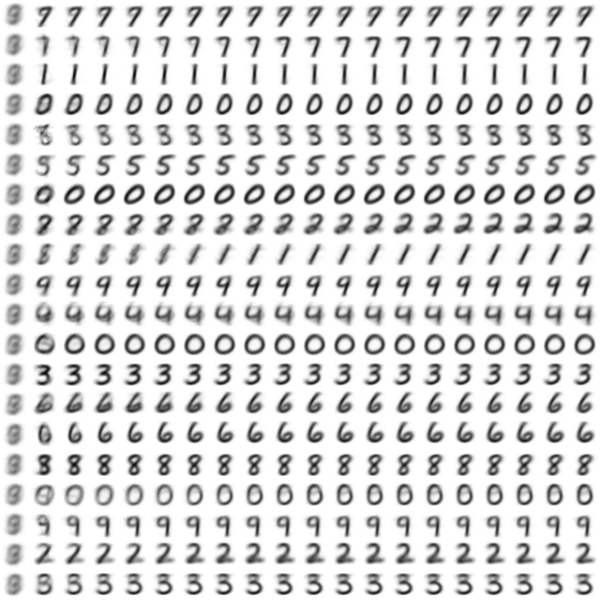

# MNIST データを K-means 法でクラスタリング

K = 20 でクラスタリングして、処理結果の各クラスタ重心に対応する画像をレンダリングする。

図は Excel でのレンダリング結果である。
クラスタ更新の1、6、11、16、21、26、31 回目のクラスタの重心に対応する画像をレンダリングしている。縦方向がクラスタ、横方向が繰り返し回数。

## 注意点

* MNIST データは 10000 個分に制限しています。処理時間が長くなりすぎるためです（現状、7 分強）。
* クラスタの更新は 10 回に固定しています。

## 参考

* ボイド & ヴェンデンベルグ（玉木 訳）、スタンフォード ベクトル・行列からはじめる最適化数学、講談社 2021
